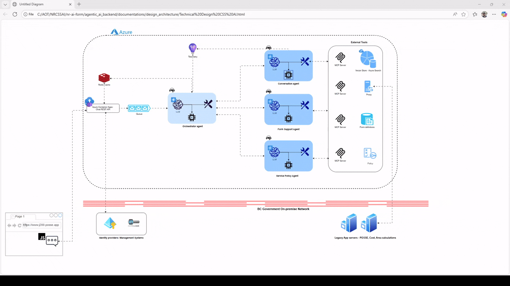
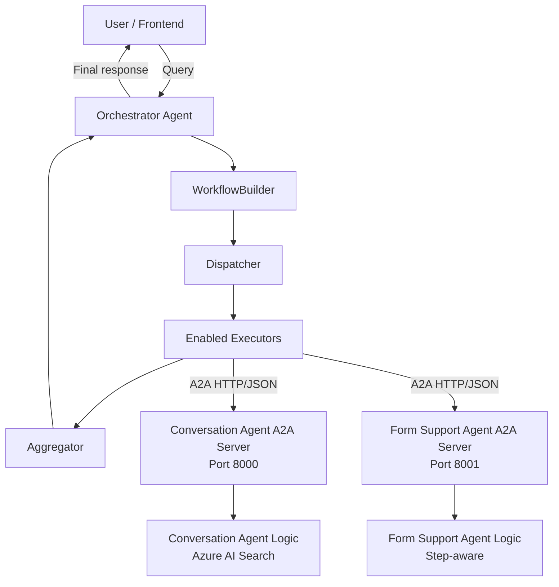
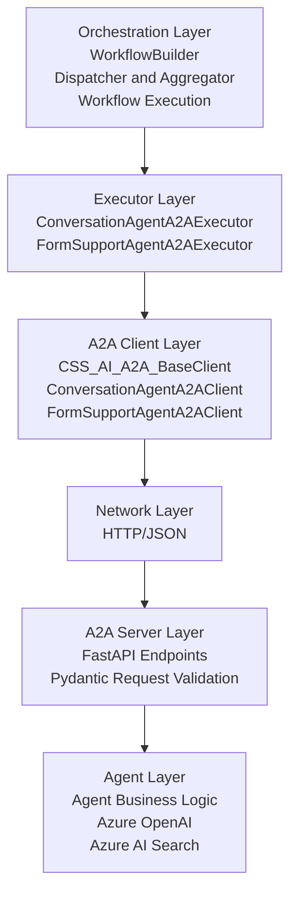
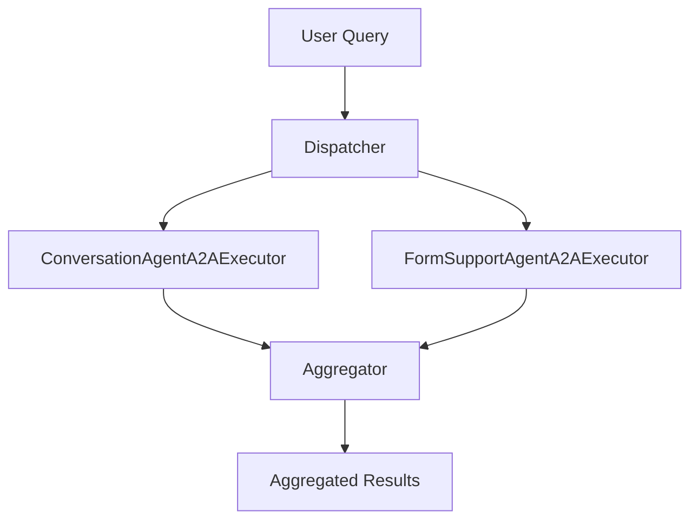
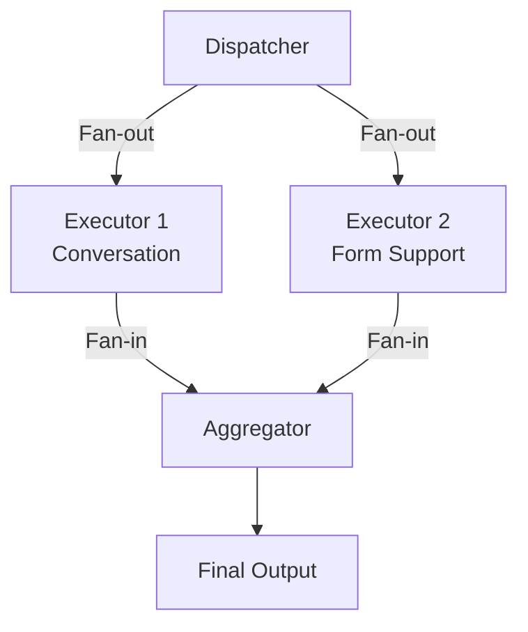

# Orchestrator Agent - Architecture Documentation

## Table of Contents
- [Overview](#overview)
- [System Architecture](#system-architecture)
- [Components](#components)
  - [Conversation Agent](#conversation-agent)
  - [Form Support Agent](#form-support-agent)
  - [Orchestrator Agent](#orchestrator-agent)
- [A2A Protocol](#a2a-protocol)
  - [What is A2A?](#what-is-a2a)
  - [A2A Client-Server Design](#a2a-client-server-design)
  - [Benefits of A2A](#benefits-of-a2a)
- [Workflow Components](#workflow-components)
- [Configuration](#configuration)
- [Usage](#usage)
- [Deployment](#deployment)

---

## Overview

The Orchestrator Agent is a multi-agent system designed for BC Government's Water Permit Application assistance. It coordinates between two specialized agents:

- **Conversation Agent**: Answers general questions using Azure AI Search
- **Form Support Agent**: Provides form-specific assistance with dynamic step support

The system uses the **A2A (Agent to Agent) protocol** for inter-agent communication, enabling a scalable, microservices-based architecture.

---

## System Architecture

### Architecture Diagram



*Interactive version available at: [Technical Design CSS AI.html](documentations/design_architecture/Technical%20Design%20CSS%20AI.html)*

### High-Level Architecture



### Architecture Layers



---

## Components

### Conversation Agent

**Purpose**: Provides conversational AI assistance for general water permit questions.

**Technology Stack**:
- **Framework**: Microsoft Agent Framework
- **LLM**: Azure OpenAI (configurable deployment)
- **Knowledge Base**: Azure AI Search
- **A2A Server**: FastAPI

**Features**:
- Semantic search across water permit documentation
- Context-aware responses
- Citation support
- Stateless operation (can be made stateful with session management)

**Directory Structure**:
```text
conversationagent/
|-- conversationagent.py              # Core agent implementation
|-- conversation_agent_a2a_server.py  # A2A HTTP wrapper
|-- agentmanifest/
|   `-- manifest.json                 # A2A capability manifest
|-- models/
|   `-- conversationmodel.py          # Request/Response models
`-- .env                              # Configuration
```

**A2A Endpoints**:
- `GET /.well-known/agent.json` - Agent manifest
- `POST /invoke` - Execute query
- `GET /health` - Health check

---

### Form Support Agent

**Purpose**: Provides intelligent form field suggestions and validation for multi-step water permit forms.

**Technology Stack**:
- **Framework**: Microsoft Agent Framework
- **LLM**: Azure OpenAI (structured output)
- **Form Definitions**: JSON-based step definitions
- **A2A Server**: FastAPI

**Features**:
- **Dynamic Step Loading**: Loads form definitions based on step number
- **Field Matching**: Matches user input to form fields
- **Structured Output**: Returns JSON with field ID and suggested values
- **Multi-Step Support**: Handles multiple form steps simultaneously
- **Caching**: Agent instances cached per step for performance

**Directory Structure**:
```text
formsupportagent/
|-- formsupportagent.py               # Core agent implementation
|-- formsupport_agent_a2a_server.py   # A2A HTTP wrapper
|-- agentmanifest/
|   `-- manifest.json                 # A2A capability manifest
|-- models/
|   `-- formsupportmodel.py           # Request/Response models
|-- formdefinitions/
|   |-- step2.json                    # Step 2 form definition
|   |-- step3.json                    # Step 3 form definition, if present
|   `-- ...
`-- .env                              # Configuration
```

**Step Number Support**:
```python
# Request with step number
{
    "query": "North Coast Transmission Pipeline",
    "session_id": "abc123",
    "step_number": 2  # Loads step2.json
}
```

**A2A Endpoints**:
- `GET /.well-known/agent.json` - Agent manifest
- `POST /invoke` - Execute query (with step_number support)
- `GET /health` - Health check

---

### Orchestrator Agent

**Purpose**: Coordinates multiple agents, aggregates responses, and manages workflow execution.

**Technology Stack**:
- **Framework**: Microsoft Agent Framework (WorkflowBuilder)
- **Communication**: A2A Protocol (HTTP/JSON)
- **Async Runtime**: asyncio
- **Environment**: python-dotenv

**Key Responsibilities**:
1. **Dispatching**: Send user query to all relevant agents
2. **Parallel Execution**: Execute agents concurrently
3. **Aggregation**: Collect and present responses
4. **Error Handling**: Manage agent failures gracefully

**Workflow Pattern**:


**Directory Structure**:
```text
orchestrators/
|-- orchestratoragent.py              # Main orchestrator
|-- a2aclients/
|   |-- a2a_client.py                 # Base A2A client
|   |-- conversationagentclient.py
|   `-- formsupportagentclient.py
|-- workflowcomponents/
|   |-- dispatcher.py                 # Query dispatcher
|   |-- aggregator.py                 # Response aggregator
|   |-- conversationagentexecutor.py
|   `-- formsupportagentexecutor.py
|-- .env                              # Configuration
`-- README.md                         # This file
```

---

## A2A Protocol

### What is A2A?

**A2A (Agent to Agent)** is a protocol for inter-agent communication that enables:
- **Discoverable** agents via standardized manifests
- **Interoperable** communication using HTTP/JSON
- **Scalable** microservices architecture
- **Language-agnostic** implementations

### A2A Client-Server Design

#### A2A Server Components

Each agent exposes three core endpoints:

```python
# 1. Discovery Endpoint
GET /.well-known/agent.json
Response: {
    "identity": {
        "name": "ConversationAgent",
        "author": "BC Government",
        "version": "1.0.0"
    },
    "capabilities": [...],
    "interaction": {
        "baseUrl": "http://localhost:8000",
        "endpoints": {...}
    }
}

# 2. Invocation Endpoint
POST /invoke

Production callers should invoke the orchestrator (`/tenants/{client_id}/invoke` or WebSocket) so tenant settings are resolved from Cosmos DB. Direct sub-agent `/invoke` calls are for local testing or service-to-service diagnostics and must include `client_settings`.

`configFingerprint` is normally generated by the orchestrator from the Cosmos tenant profile. For direct local testing, use any stable non-secret value such as `"local-test"`. Reusing the same value lets caches work normally; changing it forces fresh prompt/client cache entries.

Conversation Agent request shape:
{
    "query": "What is BCeID?",
    "session_id": "abc123",
    "client_settings": {
        "clientId": "11111111-1111-4111-8111-111111111111",
        "configFingerprint": "<tenant-config-fingerprint>",
        "agentType": "conversationAgent",
        "enabled": true,
        "blobConnectionString": "<storage-connection-string-or-secret-reference>",
        "containerName": "assets",
        "promptPath": "tenants/water/agentprompts/conversationagent/instructions.md",
        "config": {
            "conversationAgentMode": "llm",
            "azureSearchEndpoint": "<azure-ai-search-endpoint>",
            "azureSearchApiKey": "<azure-ai-search-api-key>",
            "azureSearchIndexName": "<azure-ai-search-index-name>",
            "azureSearchKnowledgeAgentName": "<knowledge-agent-name>",
            "azureSearchKnowledgeAgentApiVersion": "2025-11-01-preview",
            "azureSearchKnowledgeAgentRequestMode": "messages",
            "azureSearchKnowledgeAgentOutputMode": "answerSynthesis",
            "azureSearchKnowledgeAgentReasoningEffort": "low",
            "azureSearchKnowledgeAgentMaxOutputSize": 6000,
            "azureSearchKnowledgeAgentMaxRuntimeSeconds": 30,
            "azureSearchKnowledgeAgentMaxHistoryMessages": 10,
            "azureSearchTop": 5,
            "azureSearchTrimLength": 500,
            "azureSearchEnableTrimming": true,
            "azureSearchIncludeTotalCount": true,
            "azureSearchQueryType": "semantic",
            "azureSearchSemanticConfiguration": "semanticconfig",
            "azureSearchQueryCaption": "extractive",
            "azureSearchQueryAnswer": "extractive",
            "azureSearchQueryAnswerCount": 3,
            "azureSearchQueryLanguage": "en-US",
            "agentMaxTokens": 2500,
            "agentTemperature": 0.1,
            "azureOpenaiEndpoint": "<azure-openai-endpoint>",
            "azureOpenaiApiKey": "<azure-openai-api-key>",
            "azureOpenaiChatDeploymentName": "gpt-5.1",
            "azureOpenaiApiVersion": "2024-10-21"
        }
    }
}

Form Support Agent request shape:
{
    "query": "I am a First Nation farmer, I would like to apply for a water licence",
    "session_id": "abc123",
    "step_number": "step2-Eligibility",
    "client_settings": {
        "clientId": "11111111-1111-4111-8111-111111111111",
        "configFingerprint": "<tenant-config-fingerprint>",
        "agentType": "formSupportAgent",
        "enabled": true,
        "blobConnectionString": "<storage-connection-string-or-secret-reference>",
        "containerName": "assets",
        "promptPath": "tenants/water/agentprompts/formsupportagent/instructions.md",
        "config": {
            "formDefinitionContainer": "tenants/water/formdefinitions",
            "stepBasedPromptContainer": "tenants/water/prompttemplates",
            "azureOpenaiEndpoint": "<azure-openai-endpoint>",
            "azureOpenaiApiKey": "<azure-openai-api-key>",
            "azureOpenaiChatDeploymentName": "gpt-5.1",
            "azureOpenaiApiVersion": "2024-10-21"
        }
    }
}

Response: {
    "response": "BCeID is...",
    "session_id": "abc123"
}

# 3. Health Endpoint
GET /health
Response: {
    "status": "healthy",
    "agent": "ConversationAgent",
    "version": "1.0.0"
}
```

#### A2A Client Components

**Base Client** (`CSS_AI_A2A_BaseClient`):
```python
class CSS_AI_A2A_BaseClient:
    async def get_manifest(self) -> AgentManifest
    async def invoke(self, query: str, **kwargs) -> str
    async def health_check(self) -> Dict[str, Any]
```

**Specialized Clients**:
- `ConversationAgentA2AClient` - Defaults to port 8000
- `FormSupportAgentA2AClient` - Defaults to port 8001

### Benefits of A2A

#### Before A2A (Direct Imports)
```python
# X Tight coupling
from formsupportagent.formsupportagent import FormSupportAgent
from conversationagent.conversationagent import ConversationAgent

# X Path manipulation required
sys.path.append(agents_dir)

# X All in one process
# X Can't scale independently
# X Hard to update separately
```

#### After A2A (HTTP Communication)
```python
# OK Loose coupling
from workflowcomponents.conversationagentexecutor import ConversationAgentA2AExecutor

# OK No path manipulation
# OK Independent processes
# OK Scale each agent separately
# OK Update agents independently
```

#### Key Advantages

| Aspect | Direct Import | A2A Protocol |
|--------|--------------|--------------|
| **Coupling** | Tight | Loose |
| **Deployment** | Monolithic | Microservices |
| **Scaling** | Limited | Independent |
| **Updates** | Risky | Safe |
| **Language** | Same only | Any |
| **Testing** | Difficult | Easy (mock servers) |
| **Monitoring** | Limited | Per-service |
| **Load Balancing** | N/A | Supported |

---

## Workflow Components

### Dispatcher

**Purpose**: Receives user query and broadcasts to all executors.

```python
class Dispatcher(Executor):
    async def handle(self, userquery: str, ctx: WorkflowContext[str]):
        if not userquery:
            raise RuntimeError("Input must not be empty.")
        await ctx.send_message(userquery)
```

**Pattern**: Fan-out (1 -> N)

### Executors

**Purpose**: Communicate with remote agents via A2A and return responses.

#### ConversationAgentA2AExecutor

```python
class ConversationAgentA2AExecutor(Executor):
    def __init__(self, base_url: str = "http://localhost:8000"):
        self.client = ConversationAgentA2AClient(base_url)
    
    async def handle(self, query: str, ctx: WorkflowContext[str]):
        response = await self.client.invoke(query)
        await ctx.send_message({
            "source": self.id,
            "response": response
        })
```

#### FormSupportAgentA2AExecutor

```python
class FormSupportAgentA2AExecutor(Executor):
    def __init__(self, base_url: str = "http://localhost:8001", 
                 step_number: int = 2):
        self.client = FormSupportAgentA2AClient(base_url)
        self.step_number = step_number
    
    async def handle(self, query: str, ctx: WorkflowContext[str]):
        response = await self.client.invoke(query, step_number=self.step_number)
        await ctx.send_message({
            "source": self.id,
            "response": response,
            "step_number": self.step_number
        })
```

### Aggregator

**Purpose**: Collects responses from all executors and yields final output.

```python
class Aggregator(Executor):
    async def handle(self, results: list[Any], ctx: WorkflowContext):
        await ctx.yield_output(results)
```

**Pattern**: Fan-in (N -> 1)

### Workflow Graph



---

## Configuration

### Prerequisites

Before running docker-compose, you must set up the environment configuration file:

1. Copy the sample environment file:
   ```bash
   cp .sampleenv .env
   ```

2. Update the values in `.env` with your actual configuration. The sample file contains default values for the local Cosmos DB emulator:
   - `AZURE_COSMOS_DB_ENDPOINT` - Cosmos DB endpoint (uses emulator by default)
   - `AZURE_COSMOS_DB_KEY` - Cosmos DB key (use emulator key for local development)
   - `AZURE_COSMOS_DB_DATABASE_NAME` - Database name

3. **Optional - Client Profile Seeding**: If you plan to use client profile seeding via docker-compose, update the client profile JSON file with your actual values before running docker:
   ```bash
   # Edit this file with your actual Azure resource values
   clientprofiles/seed/client_profiles.json
   ```
   
   The docker-compose includes a `cosmos-seed` service that will automatically seed the Cosmos DB emulator with the client profiles defined in this file. Update the placeholder values (e.g., `<azure-openai-endpoint>`, `<azure-search-api-key>`, etc.) with your actual Azure resource credentials.

### Environment Variables

#### Orchestrator (`.env`)
```bash
# Agent URLs
CONVERSATION_AGENT_A2A_URL="http://localhost:8000"
FORM_SUPPORT_AGENT_A2A_URL="http://localhost:8001"

# Form Configuration
FORM_STEP_NUMBER=2

# Azure OpenAI (if needed locally)
AZURE_OPENAI_API_KEY="..."
AZURE_OPENAI_ENDPOINT="..."
AZURE_OPENAI_CHAT_DEPLOYMENT_NAME="..."
AZURE_OPENAI_API_VERSION="..."

# Azure AI Search (if needed locally)
AZURE_SEARCH_API_KEY="..."
AZURE_SEARCH_ENDPOINT="..."
AZURE_SEARCH_INDEX_NAME="..."
```

#### Conversation Agent (`.env`)
```bash
HOST="0.0.0.0"
PORT="8000"

AZURE_OPENAI_API_KEY="..."
AZURE_OPENAI_ENDPOINT="..."
AZURE_OPENAI_CHAT_DEPLOYMENT_NAME="..."
AZURE_OPENAI_API_VERSION="..."

AZURE_SEARCH_API_KEY="..."
AZURE_SEARCH_ENDPOINT="..."
AZURE_SEARCH_INDEX_NAME="..."
```

#### Form Support Agent (`.env`)
```bash
HOST="0.0.0.0"
PORT="8001"

AZURE_OPENAI_API_KEY="..."
AZURE_OPENAI_ENDPOINT="..."
AZURE_OPENAI_CHAT_DEPLOYMENT_NAME="..."
AZURE_OPENAI_API_VERSION="..."
```

See complete documentation regarding Usage, Deployment and more in the project documentation.

---

Copyright 2025 BC Government. All rights reserved.
