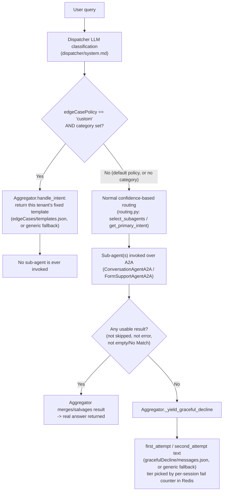

# Client Profiles - Setup Guide

## What This Does

Resolves per-tenant configuration from Cosmos DB using a `client_id`. Each tenant gets its own sub-agents, prompt paths, CORS origins, etc.

---

## Credentials

The factory picks the first available credential:

1. **`AZURE_COSMOS_DB_KEY`** - endpoint + key (local emulator, or any env without Managed Identity)
2. **`DefaultAzureCredential`** - Managed Identity (any Azure-hosted env: dev, test, prod)

### Environment Variables

| Variable | Required | Description |
|----------|----------|-------------|
| `AZURE_COSMOS_DB_ENDPOINT` | Yes | Cosmos DB endpoint URL |
| `AZURE_COSMOS_DB_KEY` | No | Account key (if not set, uses Managed Identity) |
| `AZURE_COSMOS_DB_DATABASE_NAME` | No | Defaults to `AgentMemoryDB` |
| `CSSAI_EXECUTION_ENV` | No | Set to `localhost` to disable TLS verification |

Container name (`ClientProfiles`) is hardcoded in the factory.

---

## Environment Configuration by Deployment

| Environment | `AZURE_COSMOS_DB_ENDPOINT` | `AZURE_COSMOS_DB_KEY` | `CSSAI_EXECUTION_ENV` | Auth Method |
|-------------|---------------------------|----------------------|----------------------|-------------|
| Local (venv outside Docker) | `https://localhost:8081` | Emulator master key | `localhost` | Key |
| Local (docker-compose) | `https://azure-cosmos-emulator:8081` | Emulator master key | `localhost` | Key |
| Dev (Azure Container Apps) | `https://<account>.documents.azure.com:443/` | *(do not set)* | *(do not set)* | Managed Identity |
| Test (Azure Container Apps) | `https://<account>.documents.azure.com:443/` | *(do not set)* | *(do not set)* | Managed Identity |
| Prod (Azure Container Apps) | `https://<account>.documents.azure.com:443/` | *(do not set)* | *(do not set)* | Managed Identity |

**Key rules:**
- `CSSAI_EXECUTION_ENV=localhost` disables TLS cert verification (required for emulator's self-signed cert). Never set this in Azure.
- `AZURE_COSMOS_DB_KEY` is only set for the local emulator. In Azure, omitting it makes the factory use `DefaultAzureCredential` (Managed Identity).
- Inside docker-compose, use the Docker service name `azure-cosmos-emulator` (not `localhost`) because containers resolve DNS by service name.

---

## Local Development (Emulator)

Before running the runtime services with `docker-compose up`, create the local `.env` files from `.sampleenv` and replace placeholder values with actual development values. For local seeding, `clientprofiles/scripts/seed_local_emulator.py` uses the Cosmos emulator endpoint/key defaults; the `cosmos-seed` container overrides only `COSMOS_EMULATOR_ENDPOINT` and `SEED_FILE_PATH`.

Also review `clientprofiles/seed/client_profiles.json` before seeding. Cosmos profiles should contain tenant config such as deployment names, prompt paths, search indexes, and knowledge agent names, but not raw API keys, OpenAI endpoints, storage connection strings, or blob container names. Set `AZURE_OPENAI_ENDPOINT`, `AZURE_OPENAI_API_KEY`, `AZURE_SEARCH_API_KEY`, `AZURE_SEARCH_ENDPOINT`, `AZURE_BLOBSTORAGE_CONNECTIONSTRING`, and `AZURE_BLOBSTORAGE_CONTAINER` in the relevant service `.env` files before running the services. The Docker `cosmos-seed` service only needs the Cosmos emulator endpoint and seed JSON. The orchestrator reads `agents/orchestrators/.env`, the conversation agent reads `agents/conversationagent/.env`, and the form support agent reads `agents/formsupportagent/.env` when those services start.

Do not commit real keys, OpenAI endpoints, storage connection strings, or blob container names after replacing placeholders for local testing.

**Option A: Running orchestrator outside Docker (venv)**

```bash
# 1. Start emulator
docker-compose up azure-cosmos-emulator -d

# 2. Seed data (or rely on cosmos-seed container)
cd agentic_ai_backend
python clientprofiles/scripts/seed_local_emulator.py

```

`.env` for local venv:
```
AZURE_COSMOS_DB_ENDPOINT=https://localhost:8081/
AZURE_COSMOS_DB_KEY=C2y6yDjf5/R+ob0N8A7Cgv30VRDJIWEHLM+4QDU5DE2nQ9nDuVTqobD4b8mGGyPMbIZnqyMsEcaGQy67XIw/Jw==
AZURE_COSMOS_DB_DATABASE_NAME=AgentMemoryDB
CSSAI_EXECUTION_ENV=localhost
```

**Option B: Running full stack via docker-compose**

```bash
docker-compose up
```

The `cosmos-seed` service waits for the emulator to become ready, then seeds automatically using `clientprofiles/scripts/Dockerfile.cosmos-seed`. The runtime containers use `docker-compose.yaml` to point at `https://azure-cosmos-emulator:8081`.

---

## Azure (Dev/Test/Prod)

Set only `AZURE_COSMOS_DB_ENDPOINT` on the Container App environment. Example:

```
AZURE_COSMOS_DB_ENDPOINT=https://nraif-671b-dev-cosmos.documents.azure.com:443/
```

Do NOT set `AZURE_COSMOS_DB_KEY` or `CSSAI_EXECUTION_ENV`. The app uses Managed Identity automatically with standard TLS.

Requires RBAC role assignment: `Cosmos DB Built-in Data Reader` on the Container App's managed identity.

---

## How to Resolve Tenant Config from WebSocket

Route handlers should use `TenantConfigService`, not `store.resolve()` directly:

```python
from clientprofiles import TenantConfigService, get_client_profile_store

service = TenantConfigService(get_client_profile_store())
tenant_config = await service.get_config(client_id)
profile = tenant_config.profile          # CORS/origin metadata
settings = tenant_config.settings        # validated per-agent settings
fingerprint = tenant_config.fingerprint  # safe cache version
```

`TenantConfigService` keeps a process-local fresh TTL cache and a longer stale fallback window. It resolves Cosmos once per tenant per fresh TTL, converts the `ClientProfile` into typed settings, validates required fields, and computes a short config fingerprint for cache keys.

Raises `ClientIdRequiredError` (400) if `client_id` is missing, `ClientProfileNotFoundError` (404) if not found, `TenantConfigInvalidError` (500) if the Cosmos document is missing required runtime settings, and `TenantConfigUnavailableError` (503) if Cosmos is temporarily unavailable and no stale cache is usable.

---

## Runtime Request Flow

Browser WebSocket traffic connects only to the API backend gateway plain `/ws` route; the first websocket message must include `client_id`:

```text
WS   /ws
GET  /tenants/{client_id}/history/{session_id}
```

For browser websocket traffic, the API backend is the tenant boundary:

1. The browser opens `WS /ws` on the API backend and sends the first JSON message with `client_id`, `query`, `step_number`, and `session_id`.
2. The API backend resolves the full `TenantConfig` using `TenantConfigService(get_client_profile_store())`. The store is backed by Cosmos DB through `CosmosClientProfileStore`; route code should not call Cosmos directly.
3. The API backend validates the browser `Origin` against `tenant_config.profile.corsOrigins`.
4. The API backend stores frontend sockets by tenant-scoped key: `{client_id}:{session_id}`. This permits many frontend websocket connections while preventing two tenants with the same public session id from colliding.
5. The API backend forwards each request to the orchestrator plain `/ws` route with `client_id`, `client_profile`, and `tenant_settings` in the JSON payload.
6. The orchestrator websocket validates the forwarded tenant context and uses `TenantAgentSettings` directly. It does not read Cosmos again for normal API-gateway websocket traffic. A Cosmos-backed fallback remains only for older internal callers that send `client_id` without `tenant_settings`.

The API backend keeps a single shared upstream websocket connection to the orchestrator agent (`agent_websocket`) and many browser-facing frontend websocket connections (`frontend_websockets`). Because the upstream socket follows a request/response pattern, gateway sends are serialized with a lock and the connection is recreated after communication failures.

In the websocket flow, the workflow receives `TenantAgentSettings`, not the raw Cosmos document. Sub-agent settings are converted to dictionaries only at the final A2A request boundary because the current sub-agent invoke contracts are JSON payloads. Deployment-owned values such as OpenAI/Search API keys, OpenAI endpoint, blob connection string, and blob container name are read from service environment variables and are not included in the forwarded `client_settings` payload.

Direct sub-agent calls bypass Cosmos resolution, so callers must include the full `client_settings` object in the request body. This is intended for local testing and diagnostics; production clients should call the API backend/orchestrator flow so tenant settings are resolved and validated centrally.

For normal orchestrator traffic, `configFingerprint` is generated from the Cosmos tenant profile by `build_config_fingerprint(profile)`. For direct sub-agent testing, callers may use any stable non-secret string such as `"local-test"`; changing it intentionally bypasses existing prompt/agent cache entries.

Browser-facing session ids should stay tenant-neutral, for example `session-abc123`. The orchestrator converts that public id into an internal backend key shaped as `{client_id}:{session_id}` before calling the workflow. Redis and sub-agent memory use the internal key so two tenants cannot collide if they send the same browser session id. The internal key should not be returned to the frontend.

---

## Tenant Settings Shape

`ClientProfile` remains the Cosmos document shape. At runtime it is converted into typed settings with `build_tenant_agent_settings(profile)` inside `TenantConfigService`:

- `ConversationAgentSettings` for the conversation agent.
- `FormSupportAgentSettings` for the form support agent.
- `OrchestratorPromptSettings` for dispatcher and aggregator prompt paths.

Required values fail fast during tenant config resolution, before the workflow or sub-agents run. Each sub-agent settings payload includes `clientId` and `configFingerprint` so downstream caches can be keyed safely without raw secrets.

---

## Tenant Blob Storage Content (Dispatcher/Aggregator Prompts, Edge Cases, Graceful Decline)

`tenantResources.prompts` on the Cosmos `ClientProfile` only stores blob **paths** - the actual Markdown/JSON content must be uploaded to Azure Blob Storage separately. Nothing in this repo automates that upload (no seed/Terraform script writes blob content); it is a manual step per tenant.

`workflowcomponents/skills-local/` mirrors what should exist in blob storage for the Water Permit tenant, for reference only - it is **not read at runtime** (`PromptSource.load_prompt`'s `local_rel_path` argument is explicitly ignored; there is no local-file fallback). Use it as the source of truth for what to upload, not as something the app reads directly.

| `tenantResources.prompts` field | Blob content | Local mirror | Required when |
|---|---|---|---|
| `dispatcher` | `system.md` (LLM prompt) | `skills-local/dispatcher/system.md` | Always |
| `aggregator` | `system.md` + `user.md` (LLM prompts) | `skills-local/aggregator/` | Always |
| `edgeCases` | `templates.json` (`{category_key: reply_markdown}`) | `skills-local/edgecases/templates.json` | Only when `tenantResources.config.edgeCasePolicy == "custom"` |
| `gracefulDecline` | `messages.json` (`{"first_attempt": "...", "second_attempt": "..."}`) | `skills-local/gracefuldecline/messages.json` | Optional for every tenant, regardless of `edgeCasePolicy` |

### Runtime decision flow: edge case vs. graceful decline

These are two independent mechanisms, decided by two different components at two different points in the request, and it's easy to conflate them - the diagram and table below make the split explicit.



| | Edge case | Graceful decline |
|---|---|---|
| Decided by | Dispatcher (LLM), before dispatch | Aggregator, after dispatch |
| Based on | *What the query is about* (topic classification) | *Whether anything usable came back* (absence of an answer) |
| Sub-agents invoked? | Never | Yes - always attempted first |
| Tenant knob | `edgeCasePolicy` (`"default"`/`"custom"`) | `gracefulDecline` blob path (always optional, independent) |

A query can hit graceful decline for reasons that have nothing to do with edge cases at all - e.g. a perfectly on-topic question that both sub-agents simply couldn't answer confidently.

### `edgeCasePolicy` ("default" | "custom")

Controls whether the Dispatcher's LLM classification is allowed to flag one of the six fixed `EdgeCaseCategory` buckets (`predicting_outcome`, `legal_advice`, `external_lookup`, `internal_policy`, `out_of_scope_subject`, `unrelated_topic`) for a turn, bypassing the sub-agents with a fixed reply instead.

- **`"default"`** (the implicit default if the field is omitted) - no category classification happens for this tenant at all; `Dispatcher._apply_edge_case_policy` clears `category` even if a stray LLM response sets one. This is the pre-edge-case behavior - safe for a new tenant with no onboarding work needed.
- **`"custom"`** - this tenant's own `edgeCases` blob content is loaded per request (cached by `configFingerprint`, see the cache table below). Requires `edgeCasesPromptPath` to be set - tenant profile validation fails fast otherwise. The tenant's own `dispatcher/system.md` should also describe which buckets apply and when (see `skills-local/dispatcher/system.md` for the Water tenant's "Edge-Case Category Check" section as a template).

No per-category reply text lives in code - `Aggregator` only ever holds two plain, tenant-neutral fallback strings (`FIRST_ATTEMPT_FALLBACK`/`SECOND_ATTEMPT_FALLBACK`, see the `gracefulDecline` section below). If a tenant has no `edgeCases` blob configured, or a classified category is missing from that tenant's `templates.json`, the Aggregator falls back to that plain first-attempt text rather than erroring or showing another tenant's wording.

### `gracefulDecline` (independent of `edgeCasePolicy`)

Covers the separate "I can't find a confident answer" no-answer escalation (first attempt vs. repeated-failure second attempt) - this fires whenever both sub-agents skip/error/return nothing usable, unrelated to whether the tenant uses edge-case categories at all. Any tenant may set `gracefulDecline` to get branded copy (e.g. their own support contact info) without opting into `edgeCasePolicy: "custom"`.

- If `second_attempt` is omitted from `messages.json`, it defaults to `first_attempt` (a tenant can configure one shared message for both tiers).
- If `gracefulDecline` is unset, or the blob fetch fails for any reason, both tiers fall back to `Aggregator.FIRST_ATTEMPT_FALLBACK` / `SECOND_ATTEMPT_FALLBACK` - deliberately generic, institution-agnostic text. Never rely on those hardcoded strings for tenant-specific branding; that always belongs in the tenant's own `messages.json`.

### Onboarding checklist for a new tenant

1. Upload `dispatcher/system.md` and `aggregator/{system,user}.md` to that tenant's blob paths (always required).
2. Decide `edgeCasePolicy`. Leave it unset/`"default"` unless this tenant specifically needs fixed-template short-circuiting for out-of-scope questions.
3. If `"custom"`, author and upload `edgeCases/templates.json`, and update `dispatcher/system.md` to tell the classifier when to set each category.
4. Optionally author and upload `gracefulDecline/messages.json` for branded no-answer copy - independent of step 2/3.
5. Add the tenant's `ClientProfile` document (Cosmos) with the corresponding `tenantResources.prompts` paths and `tenantResources.config.edgeCasePolicy`, then run/re-seed as described below.

---

## Runtime Caches

All caches are process-local and short TTL. Use distributed cache/session storage later if multiple replicas need shared state.

| Cache | Key shape | Default TTL |
|-------|-----------|-------------|
| Tenant config | `client_id` | `TENANT_PROFILE_FRESH_TTL_SECONDS=300` |
| Stale tenant fallback | `client_id` | `TENANT_PROFILE_STALE_TTL_SECONDS=86400` |
| Orchestrator prompts | `configFingerprint + container + prompt path + file` | `ORCHESTRATOR_PROMPT_CACHE_TTL_SECONDS=300` |
| Edge-case templates / graceful-decline messages | `clientId + configFingerprint + directory + file` | `EDGE_CASE_ASSET_CACHE_TTL_SECONDS=300` |
| Form definitions | `clientId + configFingerprint + folder + file` | `FORM_SUPPORT_ASSET_CACHE_TTL_SECONDS=300` |
| Form step prompts | `clientId + configFingerprint + folder + file` | `FORM_SUPPORT_ASSET_CACHE_TTL_SECONDS=300` |
| FormSupportAgent instances | `clientId + configFingerprint + step_id` | `FORM_SUPPORT_AGENT_CACHE_TTL_SECONDS=300` |
| Common agent prompts | `clientId + configFingerprint + promptPath` | `FORM_SUPPORT_PROMPT_CACHE_TTL_SECONDS=300`, `CONVERSATION_PROMPT_CACHE_TTL_SECONDS=300` |

Cache keys never include blob connection strings, API keys, or full tenant settings. The fingerprint changes when the tenant profile changes, which naturally invalidates old generated assets and agents.

---

## CORS and WebSocket Origin Rules
Tenant profiles should list exact origins, for example:

```json
"corsOrigins": ["https://test.j200.gov.bc.ca"]
```

Paths are ignored because browser `Origin` headers never include paths. Local development may use `http://localhost*`, which matches localhost with any port but does not match lookalike hosts such as `http://localhost.evil`. Do not use `*` in tenant profiles.

---

## Seeding Data

| Script | Target | When to use |
|--------|--------|-------------|
| `clientprofiles/scripts/seed_local_emulator.py` | Local emulator | After `docker-compose up` |
| `clientprofiles/scripts/seed_azure_cosmos.py` | Real Azure account | One-time setup (needs endpoint + key) |

Seed data lives in `clientprofiles/seed/client_profiles.json`.

The `id` field is not required in the JSON - the seed scripts automatically set `id = clientId` for each document. If `clientId` is also missing, a random UUID is generated.

Seed profiles are validated before upsert using the current strict runtime schema. Each seeded tenant must include the supported `conversationAgent` and `formSupportAgent` entries, their required config values, and the required `tenantResources.config` orchestrator runtime values. Missing required values stop the seed script before any Cosmos upsert.

---

## Known Issues

1. **Emulator data persistence is broken.** The Cosmos DB Emulator has a known issue where data is lost when the emulator is stopped, even with `AZURE_COSMOS_EMULATOR_ENABLE_DATA_PERSISTENCE=true` configured. The seed script must be rerun after every emulator restart. Reference: [Azure/azure-cosmos-db-emulator-docker#96](https://github.com/Azure/azure-cosmos-db-emulator-docker/issues/96)

2. **Azure Cosmos DB seeding requires VNet access.** For real Azure Cosmos DB, the seed script must be executed from within the VM/VNet environment because access is restricted by Cosmos DB firewall rules. External machines (including CI/CD runners) cannot reach the endpoint directly.

---

## Docker Compose (Emulator)

```yaml
azure-cosmos-emulator:
  image: mcr.microsoft.com/cosmosdb/linux/azure-cosmos-emulator
  container_name: azure-cosmos-emulator
  ports:
    - "8081:8081"
    - "10250-10255:10250-10255"
  environment:
    - AZURE_COSMOS_EMULATOR_PARTITION_COUNT=3
    - AZURE_COSMOS_EMULATOR_ENABLE_DATA_PERSISTENCE=true
  volumes:
    - cosmosdb-data:/tmp
```

> **Note:** Data persistence on the Linux emulator is unreliable across `docker-compose down`/`up`. Use `docker-compose stop`/`start` to preserve data, or re-seed after each `up`.
