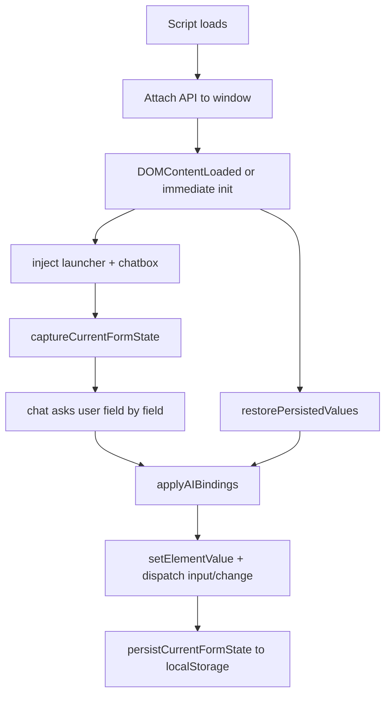

# stepmappers.js: Full Technical Explanation

## 1) What This File Is

`stepmappers.js` is a browser-side "legacy form binding" engine.

It does three main jobs:

1. Discovers interactive form fields on a page.
2. Applies value updates to those fields (simulating user input).
3. Persists/restores field values across page reloads using `localStorage`.

It also injects a small UI (launcher + chatbox) that walks through fields one-by-one and lets you update them.

---

## 2) High-Level Architecture

The file is wrapped in a UMD-style IIFE so it can attach itself to `window` safely:

- Exposes API as `LegacyAIBindingEngine` and `legacyAIBindingEngine`.
- Auto-initializes when DOM is ready.

Core modules inside the file:

1. Text normalization utilities
2. Storage/persistence layer
3. Form field discovery + metadata extraction
4. Target resolution (how an action finds an element)
5. Value application (type-specific set logic)
6. Injected UI (launcher + chat flow)
7. Public API (`captureCurrentFormState`, `applyAIBindings`, etc.)

---

## 3) Runtime Flow

---

## 4) Main Strategies Used

## Strategy A: Robust text normalization

`normalizeText` makes comparisons more stable by:

- Collapsing repeated whitespace
- Normalizing punctuation spacing
- Trimming ends

This helps matching user-entered values against option labels and inferred labels.

## Strategy B: Multi-layer label inference

`inferLabel` resolves labels in priority order:

1. `aria-label`, `title`, `placeholder`
2. Matching `<label for="...">`
3. Nearby container text heuristics (legacy table/div layouts)
4. Fallback to transformed `name`

This is tuned for old or inconsistent markup.

## Strategy C: Radio-group consolidation

Instead of treating every radio input separately, it groups radios by inferred key ( normalized `name`, normalized `id`) and stores a single field entry with:

- Group label
- Options
- Selected value

This makes action payloads cleaner and easier to map.

## Strategy D: Multi-step target resolution

When applying an action, `resolveTargetElement` tries:

1. Direct `name` match
3. Partial `id` match
4. Name-prefix match
5. DOM index fallback
6. Selector fallback

This layered fallback is essential for pages with unstable IDs.

## Strategy E: Event simulation for framework compatibility

After setting values, it dispatches both `input` and `change` events so legacy listeners and framework bindings detect updates.

## Strategy F: Per-page persistence

State key includes `origin + pathname + search`, so each page query context stores separate form state.

---

## 5) Detailed Function Behavior

## Bootstrapping

- Auto-runs `init()` when DOM is ready.
- `init()` calls `inject({ autoOpen: true })` and re-attempts restore after 150ms.
- Double-restore pattern helps with delayed DOM updates in legacy apps.

## Field discovery

- Candidate query: `input, select, textarea`
- Exclusions:
  - hidden/invisible fields
  - submit/button/reset
  - disabled fields

Result: ordered list of actionable controls.

## Capturing state (`captureCurrentFormState`)

Each captured field stores metadata:

- `domIndex`
- `name`
- `type`
- inferred `label`
- `currentValue`
- `options` (for select/radio groups)

This acts as a schema snapshot of the live form.

## Applying actions (`applyAIBindings`)

Expected action shape (flexible aliases supported):

- target identity: `name` / `targetName` / `field` / `target` / `identifier`
- target fallback: `domIndex` / `index` / `targetIndex`
- value: `value` / `newValue` / `text` / `input`

For each action:

1. Resolve target element.
2. Set value via `setElementValue`.
3. Return summary record if successful.

## Setting values (`setElementValue`)

Type-specific logic:

- Radio: match by value or nearby label text; fallback to first option.
- Checkbox: parse truthy strings (`true`, `1`, `yes`, `checked`, etc.).
- Select: match by option value, label text, or numeric index.
- Text-like fields: direct assignment.

Then dispatches `input` and `change`, and persists form state.

## UI injection

- Floating launcher button (`AI Binder`)
- Fixed-position chat panel
- Sequential prompt flow through discovered fields
- `Rescan` action to refresh field list

The chat flow is deterministic and linear (one field at a time).

---

## 6) Why This Works Well for Legacy Forms

1. It does not rely on modern framework internals.
2. It is resilient to weak semantics (table layouts, sparse labels).
3. It supports many possible action payload shapes.
4. It restores state even when page timing is imperfect.
5. It triggers native DOM events expected by older scripts.

---

## 7) Limitations and Risks

## Accuracy limitations

- Label inference may capture noisy nearby text.
- Partial `id` matching (`[id*="..."]`) can hit wrong targets on dense pages.
- Radio fallback to first option may produce unintended selections.

## Coverage limitations

- No support for rich custom widgets (Select2, datepickers, React controlled-only components) unless they react to native events.
- No deep handling of iframes/shadow DOM.

## Persistence limitations

- `localStorage` can fail (private mode/storage restrictions).
- State key ties to URL query string; minor query changes create separate state buckets.

## Security/privacy considerations

- Stores field values in browser local storage, which may include sensitive data.
- Injected chat UI could be visible in production contexts unless gated.

---

## 8) Better Options to Explore (Next Iterations)

## Option 1: Confidence-based targeting

Add a scoring engine for target resolution rather than first-match wins.

Example signals:

- exact name match
- label similarity score
- same form ancestor
- same type compatibility

Choose highest confidence above threshold.

## Option 2: Structured field fingerprinting

Persist a stable fingerprint per field:

- CSS path hash
- nearest label hash
- sibling signature
- type/name/id tuple

This can reduce wrong restores after minor DOM reorders.

## Option 3: Pluggable widget adapters

Introduce adapter hooks for known custom controls:

- Select2
- flatpickr
- jQuery UI datepicker
- masked inputs

Adapter API idea:

- `canHandle(element)`
- `getValue(element)`
- `setValue(element, value)`

## Option 4: Validation + rollback

After applying value, verify field reflects expected state.
If mismatch:

- retry with alternate matching
- log a warning
- optionally rollback previous value

## Option 5: Privacy controls

Add configuration flags:

- `persist: false` (disable storage)
- `persistAllowlist: [field names]`
- `persistDenylist: [regex for sensitive fields]`

## Option 6: Non-linear assistant flow

Instead of strict sequential prompts, support:

- "update by label/name" command mode
- "fill all from JSON" mode
- "skip all optional" mode

## Option 7: Telemetry and debug mode

Add debug output with structured logs:

- capture result count
- target resolution path taken
- value set success/failure
- restore stats

Useful for auditing behavior on complex legacy pages.

## Option 8: Test harness

Build automated browser tests (Playwright/Cypress) around:

- field discovery correctness
- action application correctness by type
- restore behavior after reload
- no regressions for radio/select heuristics

---

## 9) Suggested Refactor Plan

1. Extract pure utilities into separate module (`normalization`, `labeling`, `resolver`).
2. Add `EngineConfig` object for all behavior flags.
3. Replace inline style strings with CSS classes.
4. Add typed contracts (JSDoc or TypeScript) for action payloads and field descriptors.
5. Add unit tests for heuristic functions before changing behavior.

---

## 10) Practical Usage Notes

If you call the public API directly:

- `captureCurrentFormState(document)` returns the discoverable field map.
- `applyAIBindings([{ name, domIndex, value }])` applies updates.
- `inject()` creates launcher/chat and attempts restore.

For highly dynamic pages, call `captureCurrentFormState` right before applying actions to avoid stale indices.

---

## 11) Summary

`stepmappers.js` is a pragmatic legacy-form automation layer focused on resilience over strict semantics.

Its strongest design choices are:

- multi-pass field/label heuristics
- layered target resolution
- event-compatible value updates
- URL-scoped persistence

The best next upgrades are confidence scoring, adapter plugins, privacy guards, and automated tests.